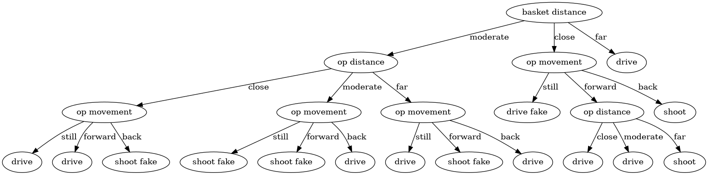

# decision-trees-example

A simple decision trees example for post https://dreamanddead.github.io/2019/10/23/decision-trees.html

## desc

问题关于篮球中三威胁进攻如何选择行动策略，具体说明见 [数据集说明](./dataset/readme.md)



## run

need
- python3
- pandas

```
$ python -m unittest discover
```
